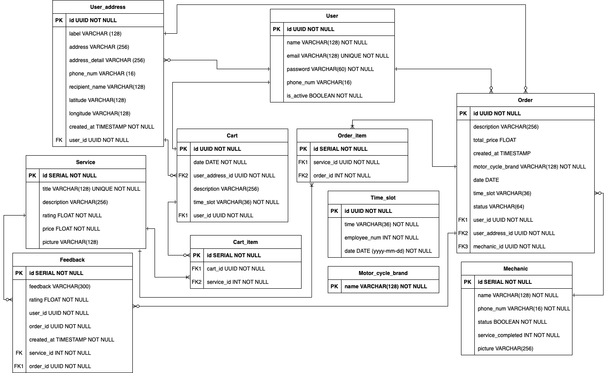

# E-Montir backend

---

Welcome to e-montir backend 🎉🎉🎉

# API Contract

---

For more information: https://e-montir.stoplight.io/docs/e-montir

# Technology Stack

---

1. Goland backend programming
2. PostgreSql (database)
3. Mailtrap (email testing)
4. Migrate
5. Adminer

# Code Structure

---

Model-view-controller (MVC) pattern is used for this project. This project has 6 major folders which are api, controller, model, db, as well as docs. It also has a root folder which is the starting point of the program (main.go). Below is the explanation for each of the folder.

1. API folder

   API folder used to handle all the incoming requests from the user and return the response to the user. All the incorming requests will be sent to controller layer where all the data will then be sent to model layer. This API consists of 3 folders which are handler, helper as well as v1.

   - "Handler" folder is used to parse all the incoming request from the user as well as generate response back to the user
   - "Helper" folder is used to assist the v1 folder. This holder is used to provide function to generate uuid, hash password, compare the hash password with the incoming password as well as validate user input.
   - "V1" folder is where the http request is being process.

2. Controller folder

   Controller folder is used to link between the API folder and the Model folder. In this folder, data from api folder will be passed to the model folder along with the instraction on how to process that data.

3. Model folder

   Model folder is used to maintain data that's sent from controller folder. This model connected to database and deal with all the data such as inserting data to database, updating data in the database, delete data from database, etc. After the instraction from controller is done, model folder will then return response back to contorller folder.

4. Docs folder

   This folder is where the API contract is stored as well as the picture about the database schema

5. DB folder

   This folder stores the db migration commands

6. pkg/jwt forlder

   This folder is used to generate json web token as well as validate that token

# Database schema

---

Below is how the database schema looks like



This app is formed from seven entities and the database used is postgreSql. Below is the brief explanation for each entity.

1. Users entity

   This entity is used to store basic information about user. It has zero to many relationship with user_payment entity. Which means that a user might have none or many payment method and that method is related to that particular user. Below is the postgreSql script for user entity :

```sql
CREATE TABLE IF NOT EXISTS "users" (
  "id" UUID NOT NULL,
  "name" VARCHAR(128) NOT NULL,
  "email" VARCHAR(128) UNIQUE NOT NULL,
  "password" VARCHAR(60) NOT NULL,
  "address" VARCHAR(256),
  "phone_num" VARCHAR(15),
  "is_active" BOOLEAN NOT NULL,
  PRIMARY KEY ("id")
) WITHOUT OIDS;
```

2. Services entity

   Below is the postgreSql script for service entity :

```sql
CREATE TABLE IF NOT EXISTS "services" (
  "id" SERIAL NOT NULL,
  "title" VARCHAR(128) UNIQUE NOT NULL,
  "description" VARCHAR(256),
  "rating" FLOAT NOT NULL,
  "price" FLOAT NOT NULL,
  "picture" VARCHAR(128),
  PRIMARY KEY ("id")
) WITHOUT OIDS;

CREATE INDEX "services_rating" ON "services" ("rating");
CREATE INDEX "services_price" ON "services" ("price");
```

3. Motor_cycle_brands entity

   Below is the postgreSql script for motor_cycle_brand entity :

```sql
CREATE TABLE IF NOT EXISTS "motor_cycle_brands" (
  "name" VARCHAR(128),
  PRIMARY KEY("name")
```

4. Time_slots entity

   Below is the postgreSql script for time_slots entity :

```sql
CREATE TABLE IF NOT EXISTS "time_slots" (
  "id" SERIAL NOT NULL,
  "time" VARCHAR(128) NOT NULL, -- time slot : 07:00 - 10:00, 10.00 - 14.00, 14.00 - 18.00
  "employee_num" INT NOT NULL DEFAULT 10,
  "date" DATE NOT NULL,
  PRIMARY KEY ("id")
) WITHOUT OIDS;

CREATE INDEX "time_slots_date" ON "time_slots" ("date");
CREATE INDEX "time_slots_time" ON "time_slots" ("time");
```

5. Orders entity

   Below is the postgreSql script for orders entity:

```sql
CREATE TABLE IF NOT EXISTS "orders" (
  "id" UUID NOT NULL,
  "title" VARCHAR(128) NOT NULL,
  "description" VARCHAR(256),
  "total_price" FLOAT NOT NULL,
  "location" VARCHAR(256) NOT NULL,
  "created_at" TIMESTAMP NOT NULL,
  "user_id" UUID NOT NULL,
  "service_id" SERIAL NOT NULL,
  "motor_cycle_brand_name" VARCHAR(128) NOT NULL,
  "time_slot_id" SERIAL NOT NULL,
  PRIMARY KEY ("id"),
  CONSTRAINT "fk_user_id" FOREIGN KEY ("user_id") REFERENCES "users" ("id") ON DELETE CASCADE ON UPDATE CASCADE,
  CONSTRAINT "fk_service_id" FOREIGN KEY ("service_id") REFERENCES "services" ("id"),
  CONSTRAINT "fk_motor_cycle_brand_id" FOREIGN KEY ("motor_cycle_brand_name") REFERENCES "motor_cycle_brands" ("name"),
  CONSTRAINT "fk_time_slot_id" FOREIGN KEY ("time_slot_id") REFERENCES "time_slots" ("id")
) WITHOUT OIDS;
```

# To run the program

---

1. Make sure docker is installed on your local
2. Run the docker
3. Create a .env file based on the .env.example file
4. Run the following command

```
docker-compose up
```

5. The server is listening to localhost:8080
